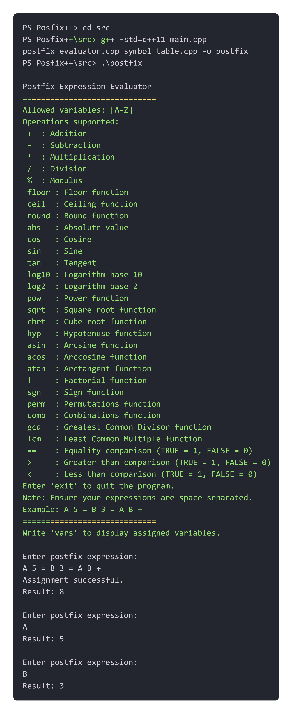

# 🥳 Postfix++: The Ultimate Postfix Expression Evaluator 🚀


Welcome to **Postfix++**! This project is all about evaluating postfix expressions with a sprinkle of awesomeness. Whether you're a computer science enthusiast, a student tackling algorithms, or just someone who loves cool projects, Postfix++ has something for you. So, let's dive in! 🏊‍♂️

## 📚 What is Postfix++?

Postfix++ is a C++ project designed to evaluate postfix (reverse Polish notation) expressions. It handles variables, supports a plethora of mathematical operations, and ensures you get the right result every time. No more scratching your head over complex postfix expressions!

## Why Postfix Notation?

Postfix notation, also known as Reverse Polish Notation (RPN), eliminates the need for parentheses and operator precedence rules, making it a breeze for both humans and machines to evaluate expressions.

## 🔥 Features

- 🧮 **Comprehensive Postfix Evaluator**: From basic arithmetic to advanced functions like logarithms and trigonometry, our evaluator handles it all.
- 📈 **Efficient Data Structures**: Implemented with stacks and symbol tables for fast and efficient evaluation.
- **Symbol Table Management**: Efficient handling of variable assignments.
- 💔**Robust Error Handling**: Detects and reports invalid expressions and operations.
- 🛠️**Modular Design**: Easy-to-read, maintain, and extend.
- 🧪 **Thoroughly Tested**: Comes with extensive unit tests to ensure reliability and correctness.

## 🚀 Getting Started

### Prerequisites

- C++ Compiler (like GCC)
- CMake
- Google Test (for unit testing)
- Visual Studio Code (highly recommended for this project)

### Installation

1. **Clone the repository**:

   ```bash
   git clone https://github.com/yourusername/PostfixPlusPlus.git
   cd PostfixPlusPlus
   ```

   IMPORTANT: go first to (tests/README-SETUP.txt)

2. **Build the project**:

   ```bash
   cd src
   g++ -std=c++11 main.cpp postfix_evaluator.cpp symbol_table.cpp -o postfix
   .\postfix
   ```

3. **Run the tests**:
   ```bash
   cmake --build . --config Release
   cd Release
   ls
    test_postfix_evaluator.exe
    test_stack.exe
    test_symbol_table.exe
   ```



## 📂 Project Structure

```plaintext
Postfix++
├── googletest               # Google Test framework
├── src                      # Source files
│   ├── main.cpp
│   ├── math_operations.hpp
│   ├── postfix_evaluator.cpp
│   ├── postfix_evaluator.hpp
│   ├── stack.hpp
│   ├── stack.cpp
│   ├── symbol_table.hpp
│   ├── symbol_table.cpp
├── tests                    # Unit tests
│   ├── CMakeLists.txt
│   ├── test_postfix_evaluator.cpp
│   ├── test_stack.cpp
│   ├── test_symbol_table.cpp
├── CMakeLists.txt           # CMake build configuration
└── README.md                # This awesome README file
```

## ✨ Highlights

### Symbol Table

The **Symbol Table** efficiently maps variable names to their values using a hash table. It's designed to handle variables named from `A` to `Z`, making it both space and time efficient.

### Postfix Evaluator

Our **Postfix Evaluator** processes expressions, handling everything from simple arithmetic to complex mathematical functions. With robust error handling and conversion between types, it ensures smooth and accurate evaluation.

### Stack Operations

The project uses a custom stack implementation to handle intermediate values during expression evaluation. This ensures that operations are performed in the correct order and that our evaluator is both fast and reliable.

## 🤝 Contributing

We welcome contributions! Feel free to fork this repository, make your changes, and submit a pull request. If you find any bugs or have feature requests, please open an issue. Let's make Postfix++ even better together!

## 📄 License

This project is licensed under the MIT License - see the [LICENSE](LICENSE) file for details.

Video demonstration: https://vimeo.com/965105062?share=copy  
Report: FINAL REPORT - Postfix++ ADS II Mid-term.pdf
